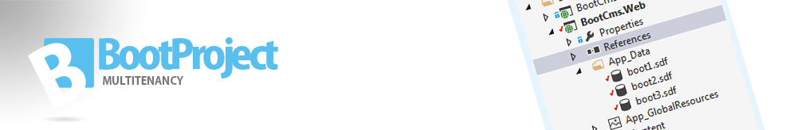

#Table of contents
>Project is divided in 3 different parts. Currently you only use the Boot.Multitenancy, but the ModelFactory and the web project is a very good start of practice.

#About Nhibernate version/reference.
The easiest way to add references, is to add FluentNHibernate from Nuget manager. This will add the correct dependensies to NHibernate and Iesi.Collections that also is needed for these project. Also if you use MySql, add MySql.Data, and set Copy local in properties to true in your web project.

Current stable of Boot.Multitenancy version is v.1.5

>  1. FluentnHibernate: 1.4.0.0
>  2. Nhibernate: 3.3.3.4001
>  3. Iesi.Collection: 3.2.0.4000
>  4. Mysql.Data: Any version (Must be included to avoid errors)

### 1. Boot.Multitenancy  

* [Configuration](setup)
* [Create Tenants](CreateTenant)
* [Host factory](Host)
* [HostContainer](SessionFactoryHostContainer)

### 2.Boot.ModelFactory

[Modelfactory](boot.modelfactory.md)

### 3. Boot.Web
Contains a Mvc 5 Project (.NET 4.5.1)

* [Goodies](boot.web.md)