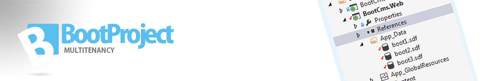

# Tenant

> The Tenant is the holder of connectionstring and a unique key for the Tenant.

> To create a Tenant there's a few things to know.

> 1. The unique name for this Tenant
> 2. Your connetionstring, a full connectionstring
> 3. A list of HostHeader values

    //The Tenant contructor takes a ITenantConfiguration configuration s argument.
    public Tenant(ITenantConfiguration configuration){}
    
    //Create config
    var conf = new TenantConfiguration(){}
    //Create a Tenant
    var Tenant= new Tenant(conf);
    

### ITenantConfiguration
TenantConfiguration is a holder of a unique key, a collection of domains and also a custom Properties, where you can add custom properties, like for eg. a Theme.

        public string Key { get; set; } //Unique key
        public DbType DbType { get; set; } //DbType.MySql
        public string Connectionstring { get; set; } //..
        public List<string> HostValues { get; set; } // "localhost|www.boot.com" ...
        public Dictionary<string, object> Properties { get; set; } //Custom properties
