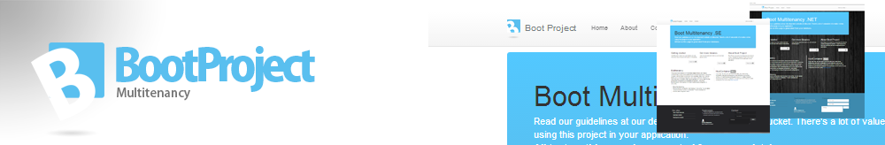

#Boot.web

>Boot.Web is a complete web application made i Mvc 5. It contains demonstration items like, Page, Content and a Settings models.

>If you want to use the default application, setup some host header values in hosts, and configure IIS to point to this application, to see it's full potential.

>Boot.Web rapidly creates and servers several domains in a single installation, all thanks to Boot.Multitenancy.

>Technique explained. The Host.Init() in startup make a call to Boot.Multitenancy, where immediately starts to configure your databases and domain.

###Helpers
There are serveral helpers built in like HtmlHelperFactory, a base ViewPage, that overrides the default ViewPage to serve gor eg. a @Zone(Region.Content) in a view. This is a part of Boot.Cms, included in this project to make you understand the benefits.

###Templating made easy
    

      

        

        @Zone(Region.Sidebar)
        

      

      

        

        @Zone(Region.Content)
        

      

    

###Create a first widget
To create a widget element, define the zone where it should be placed and on what page. Of cource, this is not as dynamic as creating a base widget, but enuff to explain the teqnique. In a real development, you probably create a base class that inherit from widget so you can load any type of widget thrue the helper.

    var widget = new Content{ Id = 1, PageId=2, Zone = Region.Content, Html="...}
